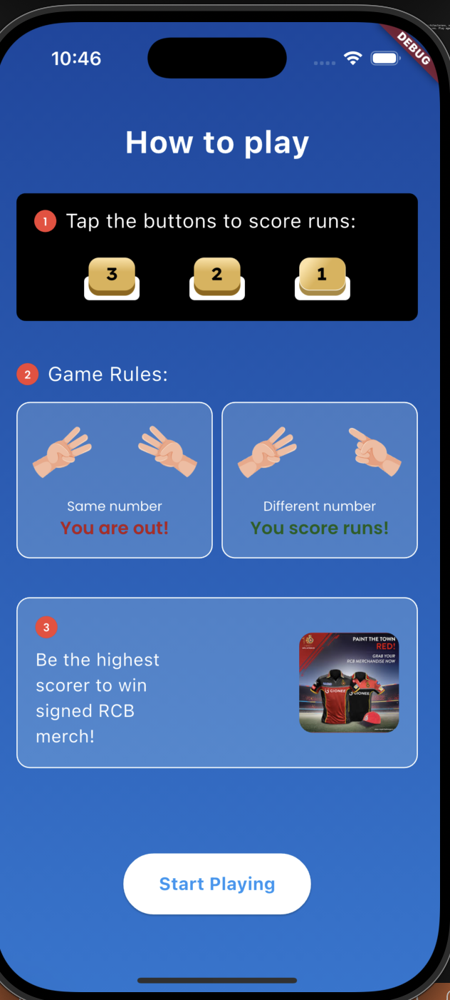
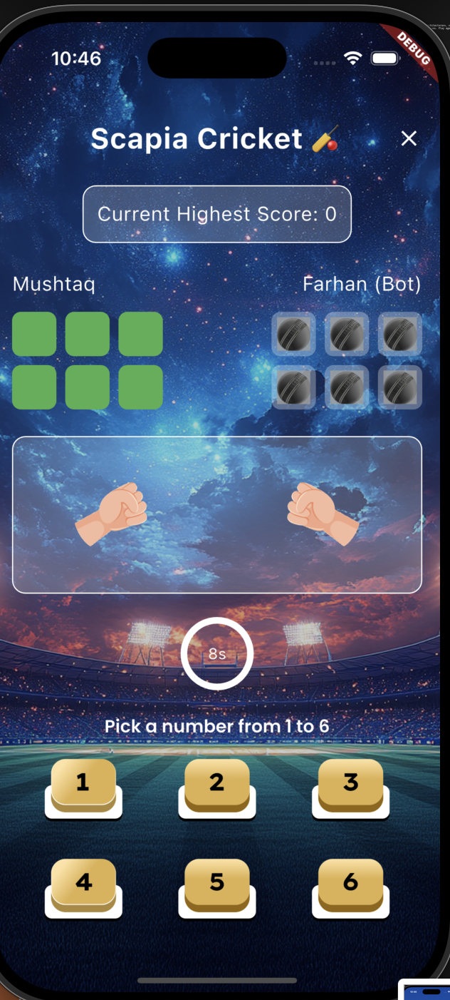
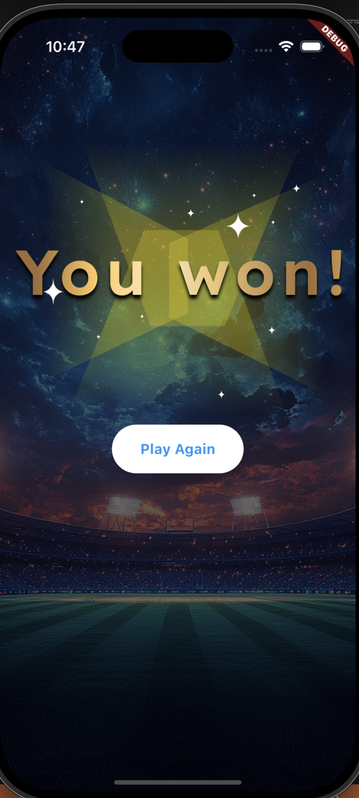

# 🏏 Hand Cricket Game App

A fun and interactive **Hand Cricket Game** built with **Flutter**, implementing **Clean Architecture**, **BLoC (Cubit + Freezed)** for state management, and custom **Manager classes** for styling, assets, and icons. Play against a bot and try to beat your highest score!

---

## 🚀 Features

- 🎮 Single-player hand cricket game vs Bot
- ↺ Turn-based gameplay
- ⏱️ Countdown timer to select numbers
- 🧠 Bot with smart move logic
- 🏆 Score tracker with highest score retention
- ✨ Smooth animations and modern UI
- 🎲 Randomized number system to simulate real gameplay
- ↺ Restart game anytime

---

## 🧱 Architecture Overview

This app follows **Clean Architecture** for maintainability and testability. Business logic, domain models, UI, and data are separated into layers.

### 🗂️ Project Structure

```
lib/
├── common/
│   └── utils/             # Helper functions
├── data/                  # (Optional for future API/storage)
├── di/                    # Dependency Injection setup
├── domain/
│   ├── entities/          # Core models (e.g., player, bot)
│   └── usecases/          # Game logic & decision-making
├── presentation/
│   ├── bloc/              # Cubit + Freezed state logic
│   ├── manager/           # Managers for styling, assets, icons
│   ├── resources/         # Enums/constants
│   ├── screens/           # Game and result screens
│   └── widgets/           # Reusable components
└── main.dart              # App entry point
```

---

## 🧰 Tech Stack & Packages

| Area                   | Packages Used |
|------------------------|----------------|
| **Architecture**       | Clean Architecture |
| **State Management**   | `flutter_bloc`, `freezed`, `equatable` |
| **Dependency Injection** | `get_it`, `injectable`, `injectable_generator` |
| **UI Styling**         | `google_fonts`, `flutter_hooks` |
| **Animation & Effects**| `lottie`, `flutter_animate` *(optional)* |
| **Asset Management**   | Manager Classes: `ColorManager`, `StyleManager`, `AssetManager`, `IconManager` |
| **Code Generation**    | `build_runner`, `freezed_annotation`, `json_annotation` |

---

## 🎨 Manager Classes Used

The project includes reusable managers to centralize styling:

- `ColorManager`: App-wide color palette
- `StyleManager`: Google Fonts and text styles
- `IconManager`: Path references for custom icons
- `RouteManager`: *(Optional)* for managing named routes

---

## 🖼️ Screenshots

> Screenshots of the game screens






---

## 📥 Getting Started

### ✅ Prerequisites

- Flutter SDK ≥ 3.29.2
- Dart SDK ≥ 3.7.2

### 🛠 Installation

```bash
# Clone the repo
git clone https://github.com/MushtaqAhmadMir/hand_cricket_game_flutter.git
cd hand-cricket-game

# Install dependencies
flutter pub get

# Run code generators
flutter pub run build_runner build --delete-conflicting-outputs

# Run the app
flutter run
```

---

## 🧚‍♂️ Running Code Generation

```bash
flutter pub run build_runner build --delete-conflicting-outputs
```

---

## 📚 Useful Commands

```bash
# Format code
dart format .

# Analyze code
flutter analyze

# Run tests (if any)
flutter test
```

---

## 🤝 Contribution

Contributions, issues, and feature requests are welcome!  
Feel free to check the [issues page](https://github.com/MushtaqAhmadMir/hand_cricket_game_flutter/issues) or create a pull request.

---

## 👨‍💼 Author

**Mushtaq Ahmad Mir**  
📧 Email: [mushtaq11917632@gmail.com](mailto:mushtaq@binaryveda.com)   
🌍 Location: Kashmir, India  
🧐 Roles: Flutter Developer | Mobile App Engineer

---

## 📄 License

This project is licensed under the **MIT License**.  
See the [LICENSE](LICENSE) file for details.

---

## 🌟 Show Your Support

If you like this project, don’t forget to:

- ⭐ Star the repo
- 🧻 Report issues
- 🙌 Recommend to others

---

Made with ❤️ by Mushtaq.

